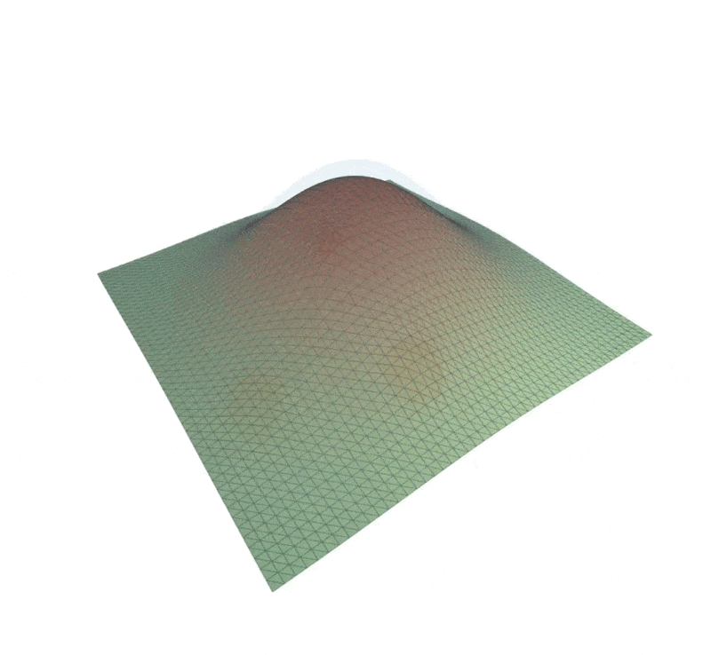
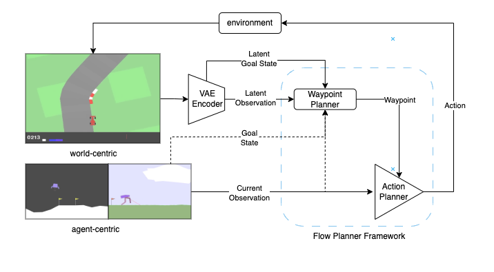

# Flow Planner 👾
Introducing **Flow Planner**, a fresh take on trajectory planning with generative models. 

**Flow Planner** is a hierarchical framework for trajectory generation built on Conditional Flow Matching (CFM). It splits planning into two parts: a long-horizon Waypoint Planner for strategy and a short-horizon Action Planner for control. Together, they run inside a receding-horizon MPC loop, combining high-level reasoning with low-latency reactivity.

## Repository Layout
```
flow_planner
├── LICENSE
├── Makefile
├── paper
├── README.md
├── setup
│   ├── environment_arm.yml
│   └── environment_x86.yml
├── src
│   ├── checkpoints
│   ├── conf
│   ├── experiments
│   ├── models
│   ├── notebooks
│   ├── pipelines
│   ├── run.py
│   └── utils
└── wandb
```

## Setup
Create the conda environment and activate it:

```bash
make setup
conda activate ./.fp
```

Download the datasets directly from the hugging face hub:
```bash
make download-datasets
```

Optionally, if you want to download the agents used for the datasets:
```bash
make download-agents
```

## Architecture


## About the Datasets

This repository runs on all three Box2D environments: LunarLander, BipedalWalker, and CarRacing. The datasets are generated by [RL Baselines3 Zoo](https://stable-baselines3.readthedocs.io/en/master/guide/rl_zoo.html) and stored using [Minari](https://minari.farama.org/index.html). For details of the algorithms used to train the agents, please consult the hyperparameters [here](https://github.com/DLR-RM/rl-baselines3-zoo/tree/master/hyperparams).
- [LunarLander](https://huggingface.co/frankcholula/ppo-LunarLanderContinuous-v3): This is the continuous version that contains 1000 episodes (335K steps).
- [BipedalWalker](https://huggingface.co/frankcholula/ppo-BipedalWalker-v3): There is also a hardcore variant, which is **NOT** included in the default download. This contains 500 episodes (346K steps).
- [CarRacing](https://huggingface.co/frankcholula/ppo-CarRacing-v3): This is also the continuous version that contains 250 episodes (245K steps).