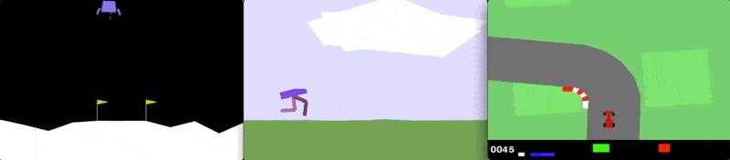

# Flow Planner 👾
Guided trajectory synthesis via flow matching.
This repository runs on all three Box2D environments: LunarLander, BipedalWalker, and CarRacing.



## Repository Layout
```
flow_planner
├── LICENSE
├── Makefile
├── paper
├── README.md
├── setup
│   ├── environment_arm.yml
│   └── environment_x86.yml
├── src
│   ├── checkpoints
│   ├── conf
│   ├── experiments
│   ├── models
│   ├── notebooks
│   ├── pipelines
│   ├── run.py
│   └── utils
└── wandb
```

## Setup
Create the conda environment and activate it:

```bash
make setup
conda activate ./.fp
```

## Dataset Generation
Datasets are generated by [RL Baselines3 Zoo](https://stable-baselines3.readthedocs.io/en/master/guide/rl_zoo.html) and stored locally in [Minari](https://minari.farama.org/index.html). 
For details of the algorithms used to train the agents, please consult the hyperparameters [here](https://github.com/DLR-RM/rl-baselines3-zoo/tree/master/hyperparams).
There is an ongoing ticket to implement a GCS bucket to store all these datasets as well. For now, you'll have to run the generate script in order to create the datasets.
- [LunarLander](https://huggingface.co/frankcholula/ppo-LunarLanderContinuous-v3)
- [BipedalWalker](https://huggingface.co/frankcholula/ppo-BipedalWalker-v3)
- [CarRacing](https://huggingface.co/frankcholula/ppo-CarRacing-v3)
